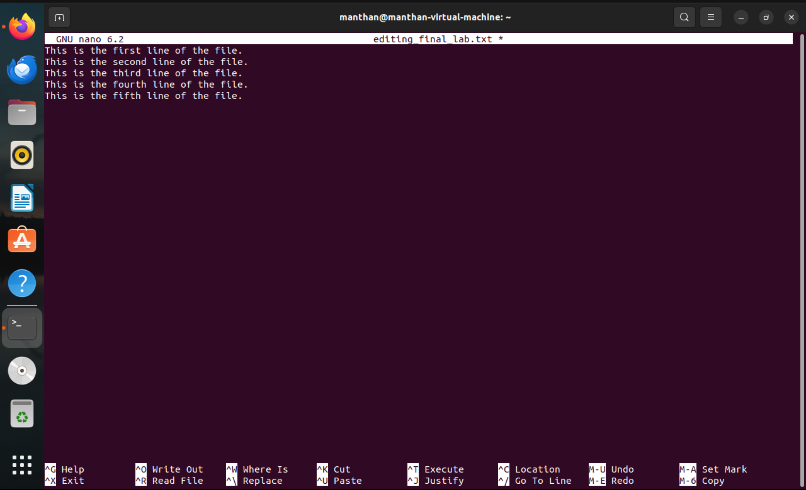
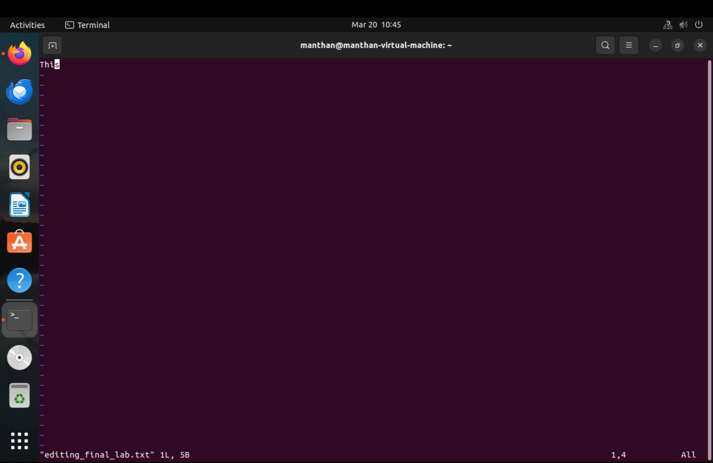
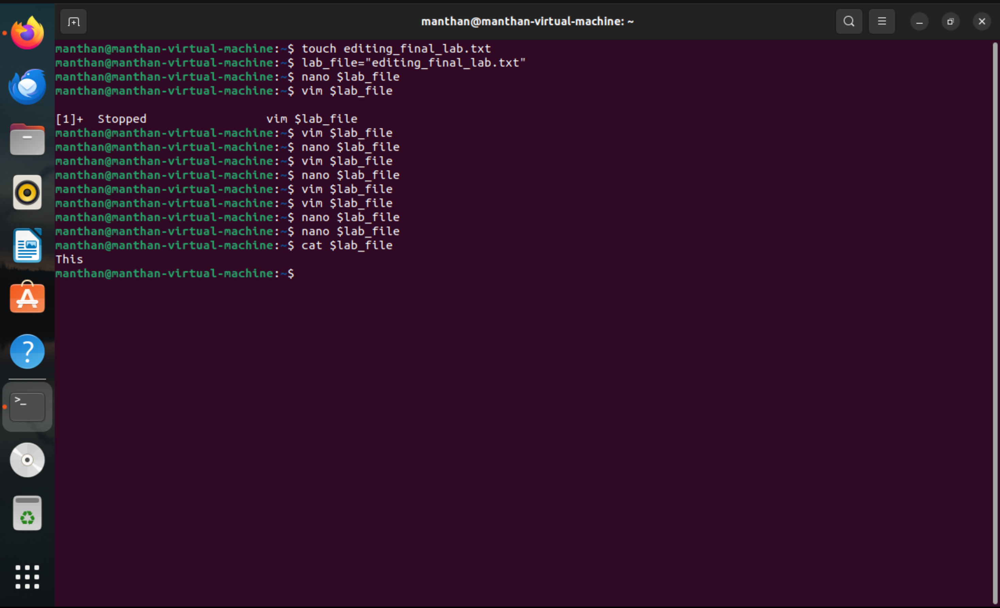

# Experiment 3

---

## Experiment Description
This lab focuses on editing files in Linux using two popular text editors: **Nano** and **Vim**. The tasks include creating a file, editing it using both editors, and performing specific text manipulation tasks in Vim.

---

## Approach

### 1. Preparing the Lab File
Ensure the file `editing_final_lab.txt` exists. If not, create it using:
```bash
touch editing_final_lab.txt
```

To simplify file access, store its path in a shell variable:
```bash
lab_file="editing_final_lab.txt"
```

---

### 2. Editing with Nano
Nano is a beginner-friendly text editor.

#### Steps:
1. Open the file in Nano:
   ```bash
   nano $lab_file
   ```
2. Add the following lines:
   ```
   This is the first line of the file.
   This is the second line of the file.
   This is the third line of the file.
   This is the fourth line of the file.
   This is the fifth line of the file.
   ```
3. Save the changes (`CTRL + O`) and exit (`CTRL + X`).

#### Screenshot:


---

### 3. Editing with Vim
Vim is a powerful text editor with advanced features.

#### Steps:
1. Open the file in Vim:
   ```bash
   vim $lab_file
   ```
2. **Delete the Last Seven Characters of the First Line**:
   - Enter visual mode (`v`), highlight the last seven characters, and press `d`.
3. **Keep Only the First Four Characters of the First Line**:
   - Move to the start of the line, press `4l`, enter visual mode (`v`), highlight the rest, and press `d`.
4. Save and exit:
   - Press `ESC`, type `:wq`, and press `Enter`.

#### Screenshot:


---

## Verifying Command Execution
To confirm the changes, display the file's contents:
```bash
cat $lab_file
```

#### Screenshot:


### Expected Output:
If the file initially contained:
```
This is the first line of the file.
This is the second line of the file.
This is the third line of the file.
This is the fourth line of the file.
This is the fifth line of the file.
```

After editing with Vim, the first line should appear as:
```
This
```

---

## Conclusion
In this lab, you learned how to:
- Use **Nano** for basic file editing.
- Use **Vim** for advanced text manipulation, including deleting specific characters and retaining selected portions of text.

These skills are essential for efficient file editing and Linux scripting.
