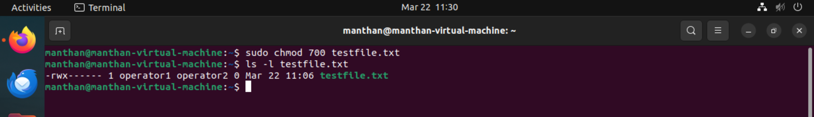

# Experiment 7

---

## Experiment Description
This lab focuses on managing file ownership and permissions in Linux using the `chown` and `chmod` commands. Tasks include changing ownership, modifying permissions, and applying special permissions.

---

## Approach

### 1. Managing File Ownership with `chown`
The `chown` command is used to change the owner and/or group of files and directories.

#### a. Changing the Owner of a File
```bash
sudo chown operator1 testfile.txt
```

#### Screenshot:


---

#### b. Changing Both Owner and Group
```bash
sudo chown operator1:operator2 testfile.txt
```

#### Screenshot:


---

#### c. Recursive Ownership Changes
```bash
sudo chown -R operator1:operator1 testdirectory/
```

#### Screenshot:


---

#### d. Using a Reference File for Ownership
```bash
sudo chown --reference=referencefile.txt targetfile.txt
```

#### Screenshot:


---

### 2. Managing File Permissions with `chmod`
The `chmod` command is used to modify file access permissions for the owner, group, and others.

#### a. Setting Permissions Using Numeric Mode (Octal)
1. Assign read, write, and execute permissions to the owner only:
   ```bash
   chmod 700 testfile.txt
   ```
   **Explanation**: Owner gets full permissions (7), group and others get none (0).

   #### Screenshot:
   

2. Assign read and write for the owner, and read-only for group and others:
   ```bash
   chmod 644 testfile.txt
   ```

   #### Screenshot:
   

---

#### b. Setting Permissions Using Symbolic Mode
1. Add execute permission for the owner:
   ```bash
   chmod u+x testfile.txt
   ```

   #### Screenshot:
   

2. Remove write permission for the group:
   ```bash
   chmod g-w testfile.txt
   ```

   #### Screenshot:
   

3. Add read permission for others:
   ```bash
   chmod o+r testfile.txt
   ```

   #### Screenshot:
   

4. Set multiple permissions at once:
   ```bash
   chmod u+rwx,g+rx,o+r testfile.txt
   ```

   #### Screenshot:
   

---

#### c. Recursive Permission Changes
Apply permissions recursively to a directory:
```bash
chmod -R 755 testdirectory/
```

#### Screenshot:


---

#### d. Special Permissions
1. Set SUID permission:
   ```bash
   chmod u+s testfile.txt
   ```
   **Explanation**: Allows execution with the file owner's permissions.

   #### Screenshot:
   

2. Set SGID permission:
   ```bash
   chmod g+s testdirectory/
   ```
   **Explanation**: Ensures new files inherit the directory's group.

   #### Screenshot:
   

3. Set the sticky bit:
   ```bash
   chmod +t testdirectory/
   ```
   **Explanation**: Prevents users from deleting files owned by others.

   #### Screenshot:
   

---

### 3. Combining `chown` and `chmod`
Change ownership and permissions together:
```bash
sudo chown operator1:operator2 testfile.txt
chmod 750 testfile.txt
```

#### Screenshot:


---

## Conclusion
In this lab, you practiced:
1. Changing file and directory ownership using `chown`.
2. Modifying file and directory permissions using `chmod`.
3. Applying recursive changes and special permissions (SUID, SGID, Sticky Bit).
4. Verifying permission and ownership changes.

These skills are essential for managing file security and ensuring proper access control in Linux environments.
